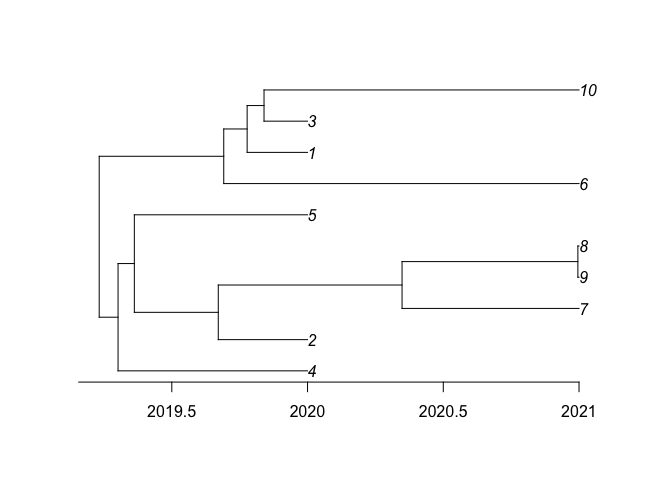
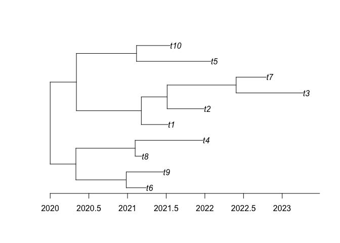

<!-- README.md is generated from README.Rmd. Please edit that file -->

# BoundedCoalescent

BoundedCoalescent is a R package to simulate and compute the probability
of phylogenies under the bounded coalescent model. This model is
obtained by conditioning the standard coalescent so that the most recent
ancestor of the whole sample occurs after a set date.

## Installation

You can install BoundedCoalescent from github with:

``` r
devtools::install_github("DrJCarson/BoundedCoalescent")
```

The package can then be loaded using:

``` r
library(BoundedCoalescent)
```

## Quick usage

Let’s simulate a tree with 5 leaves in 2020 plus 5 leaves in 2021, with
an effective population size \(N_e=2\) and a bound in 2019:

``` r
library(ape)
t=bounded_sample_phylo(c(2020,2021),c(5,5),2,2019)
plot(t$phylo)
axisPhylo(1,backward = F)
```

<!-- -->

Let’s calculate the probability of a random rtree with root in 2020,
effective population size \(N_e=2\) and a bound in 2019:

``` r
library(ape)
t=rtree(10)
t$root.time=2020
plot(t)
axisPhylo(1,backward = F)
```

<!-- -->

``` r
bounded_likelihood_phylo(t,2,2019)
#> [1] 2.300288e-06
```

## More information and getting help

For more detailed examples of how to use BoundedCoalescent, see the
vignettes
[here](https://github.com/DrJCarson/BoundedCoalescent/tree/master/vignettes).
See also the help included in the package using the R command
`help(package='BoundedCoalescent')`.

If you have any problem or question please create an issue
[here](https://github.com/DrJCarson/BoundedCoalescent/issues).
